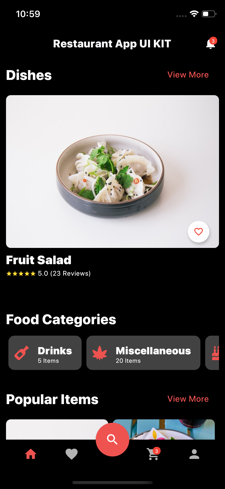
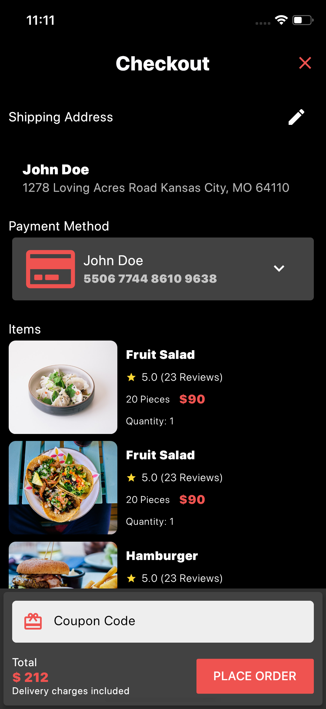

# AzShop-kit Flutter project
This is a clone of https://github.com/atornel/RestaurantAppUIKit and credit to the author!
Beautiful prototype but need optimizing much.

# This tip-trick shows off how to rename package for both ios and android in any Flutter project

    1. Go to build.gradle in app module and rename applicationId "com.company.name"
    2. Go to Manifest.xml in app/src/main and rename package="com.company.name" and android:label="App Name"
    3. Go to Manifest.xml in app/src/debug and rename package="com.company.name"
    4. Go to Manifest.xml in app/src/profile and rename package="com.company.name"
    5. Go to app/src/main/kotlin/com/something/something/MainActivity.kt and rename package="com.company.name"
    6. Go to app/src/main/kotlin/ and rename each directory so that the structure looks like app/src/main/kotlin/com/company/name/
    7. Go to pubspec.yaml in your project and change name: something to name: name, example :- if package name is com.abc.xyz the name: xyz
    8. Go to each dart file in lib folder and rename the imports to the modified name. Rename folders related to package name "com.company.name"
    9. Open XCode and open the runner file and click on Runner in project explorer.
    10. Go to General -> double click on Bundle Identifier -> rename it to com.company.name
    11. Go to Info.plist click on Bundle name -> rename it to your App Name.
    close everything -> go to your flutter project and run this command in terminal flutter clean
   
   Credit to the author https://stackoverflow.com/users/11876780/gagan-raghunath 

## ğŸ”🔠Restaurant app UI KIT 

Flutter representation of a full Restaurant app UI KIT.

Star⭐ the repo if you like what you see😉.

Images are from [Unsplash](https://unsplash.com)

<a href="https://api.codemagic.io/artifacts/e28bb36b-8062-4065-84cd-e927ce2f7d7d/d34096be-fdda-44fa-ba1d-369264d980af/app-release-universal.apk"></img></a>

## 📸 ScreenShots

**Some screenshots below**
 
 

| Light| Dark|
|------|-------|
|||
|||
|||
|||

## 🔖 LICENCE
[Apache-2.0](https://github.com/JideGuru/FlutterEbookApp/blob/master/LICENSE)
